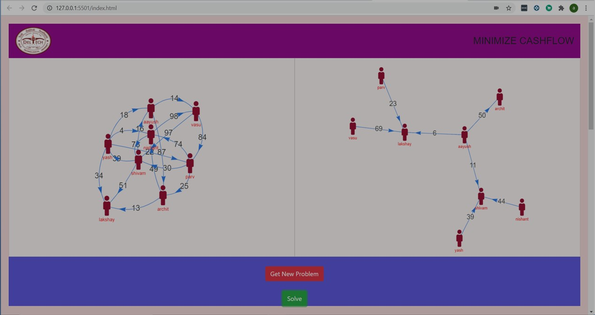

**SplitwiseApp : Minimize Cash Flow Algorithm**

This project aims to ease several transactions into minimal transactions to make transactions more accessible and efficient. The underlying data structure used for the implementation of the project is heaps that can be visualized through a directed graph.

